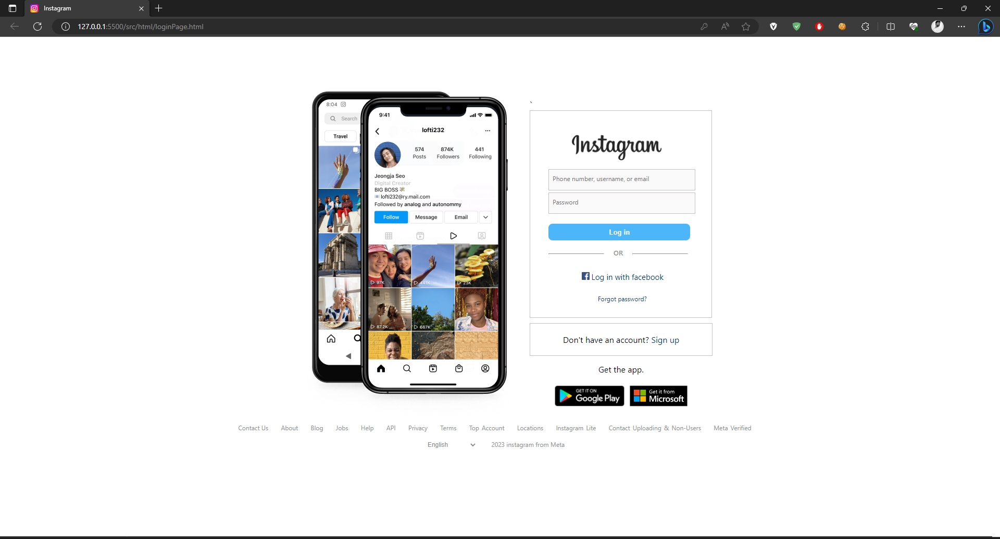
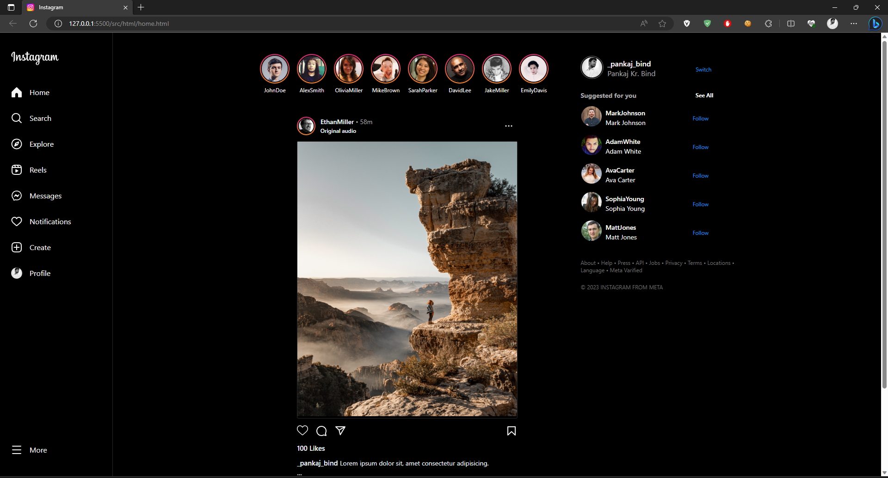

# Instagram Website Clone
## Test id="username" Password="password"

## Project Overview

Welcome to the Instagram Website Clone project! This project showcases my web development skills by creating a replica of the popular social media platform, Instagram. By utilizing HTML, CSS, and JavaScript, I've recreated the user interface and some of the key features of Instagram's website. Please note that this project is purely for educational and portfolio purposes and is not affiliated with Instagram.

Explore the world of social media through this clone's interface and get a glimpse of how Instagram's design and functionality work together.

## Table of Contents

- [Project Overview](#project-overview)
- [Features](#features)
- [Technologies Used](#technologies-used)
- [Usage](#usage)
- [Contributions](#contributions)
- [License](#license)

## Features

1. **User Authentication**: Experience a simplified login and registration process that simulates the Instagram account access.

2. **Feed Display**: Browse through a simulated feed of images and posts, resembling the Instagram home page.

3. **Image Upload**: Utilize the image upload functionality to add your own photos and see how it could work on Instagram.

4. **Like and Comment**: Interact with the posts by liking them and adding comments, similar to the Instagram interaction.

5. **Responsive Design**: Enjoy a responsive design that adapts the layout to various screen sizes, just like Instagram's responsive website.

## Technologies Used

- HTML5
- CSS3
- JavaScript

## Usage

To use this Instagram Clone, follow these steps:

1. Open the `index.html` file in your web browser to view the Instagram clone.
2. Use the provided login or registration functionality to access the clone's features.
3. Navigate through the simulated feed, upload images, like posts, and add comments to experience the clone's functionality.

Feel free to explore and interact with the various features to get a sense of how the Instagram interface works.

## Contributions

Welcoming contributors to enhance the project collaboratively. Join to improve and innovate together!

## License

This project is licensed under the [MIT License](LICENSE).
